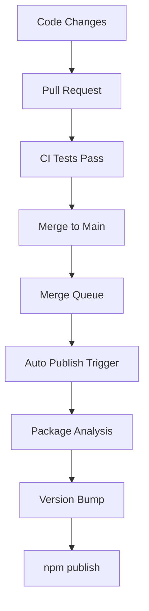

The nodejs.org repository is a monorepo. Alongside the main website application in `apps/site/`, it contains standalone npm packages in the `packages/` directory that are published to the npm registry.

## Repository structure

```
nodejs.org/
├── apps/
│   └── site/                    # Main website — @node-core/website
└── packages/
    ├── ui-components/           # @node-core/ui-components
    ├── i18n/                    # @node-core/website-i18n
    └── [other-packages]/        # Additional workspace packages
```

Published packages:

<CardGroup cols={2}>
  <Card title="@node-core/ui-components" icon="palette">
    Reusable React UI components shared across Node.js web properties. Compiled TypeScript + CSS, published to npm.
  </Card>
  <Card title="@node-core/website-i18n" icon="language">
    Internationalization utilities and locale string bundles used by the website.
  </Card>
</CardGroup>

## Publishing process

Publishing is fully automated through GitHub Actions. You do not need to run `npm publish` manually under normal circumstances.

<Steps>
  <Step title="Open a pull request">
    Make your changes and open a PR. The "Linting and Tests" CI workflow must pass.
  </Step>
  <Step title="Merge via merge queue">
    Changes must enter the main branch through GitHub's merge queue. Direct pushes to `main` are not permitted.
  </Step>
  <Step title="Automatic publish trigger">
    After a successful merge, the "Publish Packages" GitHub Actions workflow triggers automatically. It verifies that the committer is `noreply@github.com` (the GitHub Actions bot) before proceeding.
  </Step>
  <Step title="Package analysis and version bump">
    The workflow analyzes which packages changed and bumps their versions accordingly.
  </Step>
  <Step title="npm publish">
    The workflow compiles TypeScript, compiles CSS, and runs `npm publish` for each changed package.
  </Step>
  <Step title="Slack notification">
    If the workflow was triggered via `workflow_dispatch` (manual dispatch), a notification is sent to `#nodejs-website` on Slack.
  </Step>
</Steps>



## Manual workflow dispatch

The "Publish Packages" workflow can also be triggered manually from the GitHub Actions tab using `workflow_dispatch`. This is useful if the automatic trigger failed or if you need to republish a package without new commits.

<Warning>
  Manual dispatch sends a Slack notification to `#nodejs-website`. Only use it when necessary.
</Warning>

## Compile step

Before publishing, packages are compiled via the `compile` Turborepo task:

```bash
pnpm compile
```

This runs the `compile` script in each package workspace, which typically:

1. Compiles TypeScript source to JavaScript (`tsc`)
2. Compiles CSS (e.g. Tailwind PostCSS processing)
3. Outputs artifacts to the `dist/` directory

The published package contains only the compiled output, not the TypeScript source.

## Version bumping

Version numbers are managed by the publishing workflow. Do not manually bump versions in `package.json` files — the automation handles this as part of the publish step.

<Note>
  Workspace-internal dependencies (using `workspace:*` specifiers) are resolved to their actual published versions by pnpm when publishing.
</Note>
